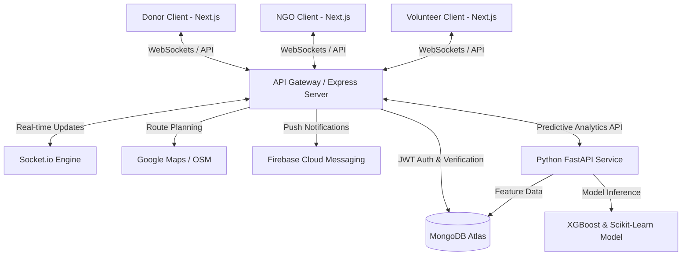

 # 🍕 Food Rescue Connect

> A real-time, AI-driven logistics and matching platform bridging the gap between food donors, volunteers, and NGOs to minimize food waste and support communities.

---

[](https://nextjs.org/)
[](https://www.typescriptlang.org/)
[](https://tailwindcss.com/)
[](https://nodejs.org/)
[](https://expressjs.com/)
[](https://www.mongodb.com/)
[](https://fastapi.tiangolo.com/)
[](https://www.python.org/)
[](LICENSE)

Food Rescue Connect is designed to solve one of society's most pressing issues: food waste. By integrating real-time geolocation matching, socket-based chat/coordination, automated route optimization, and AI-driven demand & wastage predictions, this platform elevates the food recovery pipeline into an intelligent, high-efficiency logistics ecosystem.

---

## 🗺️ Table of Contents
1. [👥 User Roles & Permissions](#-user-roles--permissions)
2. [💡 Core Features](#-core-features)
3. [⚙️ System Architecture](#️-system-architecture)
4. [🛠️ Tech Stack](#️-tech-stack)
5. [🚀 10-Phase Roadmap](#-10-phase-roadmap)
6. [🔥 Placement Boosters (AI & Real-time)](#-placement-boosters-ai--real-time)
7. [💻 Local Development Setup](#-local-development-setup)
8. [📊 Impact & Analytics Dashboard](#-impact--analytics-dashboard)
9. [📈 Production Deployment & Scaling](#-production-deployment--scaling)

---

## 👥 User Roles & Permissions

The application features a secure, role-based access control (RBAC) mechanism defining four primary user personas:

```
┌────────────────────────────────────────────────────────┐
│                   Food Rescue Connect                  │
└───────┬───────────────┬────────────────┬───────┬───────┘
        │               │                │       │
┌───────▼───────┐┌──────▼───────┐┌───────▼──────┐┌▼──────┐
│     Donor     ││ NGO/Receiver ││  Volunteer   ││ Admin │
└───────────────┘└──────────────┘└──────────────┘└───────┘
```

| Role | Core Purpose | Primary Actions |
| :--- | :--- | :--- |
| **Donor** (Restaurants, Hotels, Individuals) | Provide surplus edible food | Upload listings, specify expiry/quantity, select packaging types, track volunteer pickup. |
| **NGO / Receiver** | Receive and distribute food | Set rescue range preferences, receive automated notifications, accept matching listings, manage inventory. |
| **Volunteer** | Provide transport & logistics | Claim delivery tasks, view optimized routing, communicate status (picked up, en route, completed). |
| **Admin** | Monitor, audit & manage system | Access global analytics (CO₂ saved, meals rescued), manage users, resolve disputes, oversee platform health. |

---

## 💡 Core Features

### 🟢 Real-Time Food Matching
* **Multi-Criteria Optimization:** Match listings based on distance, volume, packaging type, and expiry window.
* **Proximity Alerts:** Automatically alert the nearest NGOs (within a 5km radius) when fresh food is posted.
* **Instant Handshakes:** Instantaneous connection through WebSockets when an NGO accepts a donation.

### 📍 Maps & Live Tracking
* **Interactive Live Maps:** Map interfaces showing active donation points, volunteer routes, and drop-off hubs.
* **Route Optimization:** Multi-stop routing algorithm using OpenStreetMap/Google Maps API to minimize transport time.
* **Real-Time Progress:** Live tracking of volunteer movements showing real-time ETA updates.

### 🔔 Smart Notification System
* **Instant Alerts:** Web socket and push notifications for urgent pickups.
* **Status Updates:** Immediate alerts to donors when food is matched, picked up, and safely delivered.

### 🧠 AI Analytics & Predictions
* **Food Wastage Predictor:** Analyzes historical pickup patterns to flag listings at high risk of expiring before pickup.
* **NGO Recommendation:** Suggests the best distribution center based on historic consumption rates.
* **Demand Forecasting:** Predicts weekly food surplus patterns in specific zones to allocate volunteer squads proactively.

---

## ⚙️ System Architecture



---

## 🛠️ Tech Stack

### Frontend & UI
* **Framework:** Next.js 14 (App Router) with TypeScript
* **Styling:** Tailwind CSS & Shadcn UI
* **State Management:** React Context / Zustand
* **Maps Integration:** React Leaflet / Google Maps Javascript API

### Backend & Databases
* **Server Runtime:** Node.js
* **Backend Framework:** Express.js
* **Database:** MongoDB Atlas (Mongoose ODM)
* **Real-time Engine:** Socket.io
* **Authentication:** JSON Web Tokens (JWT) + Google OAuth

### AI / ML Microservice
* **Framework:** FastAPI (Python 3.10+)
* **Libraries:** Scikit-learn, XGBoost, Pandas, NumPy
* **Deployment:** Dockerized containment

---

## 🚀 10-Phase Roadmap

### 📋 Phase 1 — Project Planning & Requirements
- [x] Define precise database models for Users, Food Listings, Donations, and Volunteers.
- [x] Map complete API endpoint routes and payload structures.
- [x] Wireframe key navigation pathways for all 4 roles.

### 🎨 Phase 2 — UI/UX Design
- [x] Design custom dashboard templates for Donor, NGO, and Volunteer roles.
- [x] Establish design tokens (consistent spacing, curated warm color palette, typography).
- [x] Create detailed Figma prototypes focusing on high-fidelity responsive mockups.

### 🏗️ Phase 3 — Frontend Foundation
- [x] Scaffold Next.js application with TypeScript and Tailwind CSS.
- [x] Implement global layouts including Navbars, Sidebars, and Footer components.
- [x] Build reusable UI blocks (cards, buttons, modal windows, forms with validation).

### 🔒 Phase 4 — Backend & Database Setup
- [x] Initialize Node.js & Express server with absolute path routing.
- [x] Set up MongoDB Atlas cluster and mongoose schemas.
- [x] Implement standard RESTful controllers for base CRUD operations.

### 🛡️ Phase 5 — Authentication & Role-Based Access Control
- [x] Set up JWT verification middleware.
- [x] Implement password hashing using bcrypt.
- [x] Create role guards for API endpoints (`/api/donor/*`, `/api/ngo/*`, `/api/volunteer/*`).

### ⚡ Phase 6 — Real-Time Food Matching
- [x] Build geo-indexing queries in MongoDB.
- [x] Develop the Haversine formula backend helper to calculate distances dynamically.
- [x] Integrate Socket.io server-side for broadcast alerts to nearby NGOs.

### 🗺️ Phase 7 — Maps & Tracking System
- [x] Render interactive map UI on the Volunteer interface using Leaflet and OpenStreetMap.
- [x] Add OSRM (Open Source Routing Machine) map overlays for active route paths.
- [x] Integrate live geolocation tracking sending latitude/longitude updates over WebSockets.

### 💬 Phase 8 — Multi-channel Notifications
- [x] Add support for browser-native Web Push Notifications via Service Workers (no Firebase required).
- [x] Set up Nodemailer for transactional emails (e.g. signup, recovery, pickup completions) using Brevo SMTP.
- [x] Implement in-app persistent notification logs.

### 🔮 Phase 9 — AI/ML Features (Placement Booster)
- [x] Create FastAPI microservice backend.
- [x] Train an XGBoost model using historical delivery times, distance, and expiry to forecast the probability of food spoilage.
- [x] Integrate recommendation endpoint indicating the best NGO based on current storage capacity and active needs.

### 🐳 Phase 10 — Deployment, Scaling & Monitoring
- [x] Write optimized multi-stage Dockerfiles for Frontend, Backend, and ML services.
- [x] Set up continuous integration and deployment (CI/CD) pipelines to Vercel and Render via GitHub Actions.
- [x] Add Prometheus/Grafana or Winston logging for exception monitoring and rate-limiting.

---

## 🔥 Placement Boosters (AI & Real-time)

This project stands out from standard full-stack CRUD applications by addressing complex real-time coordination and predictive algorithms:

1. **Smart Expiry Risk Prediction:**
   * Uses a trained machine learning model inside a Python microservice to predict the likelihood of a donation going to waste (Expiry Risk Index).
   * **Formula Variables:** Distance, expiry duration, active volunteer density in the area, and historical claiming rates.
   * **Actionable Insight:** If Risk > 70%, the system triggers priority push alerts and escalates matching radius from 5km to 15km.

2. **Real-Time Geolocation Coordination:**
   * Leverages WebSockets via Socket.io to stream real-time coordinate updates from the volunteer's mobile app directly to the donor and receiving NGO's screens.

3. **Dynamic Route Optimization:**
   * Utilizes Open Source Routing Machine (OSRM) free endpoints to offer volunteers the fastest path, rendering a live purple polyline route on the interactive Leaflet map.

4. **Rescue Copilot AI:**
   * A floating smart chat widget providing real-time contextual assistance for volunteers and NGOs, predicting spoilage risks and explaining carbon impact metrics.

5. **Advanced Environmental Impact Analytics:**
   * Dynamic dual-axis Recharts visualizations rendering weekly CO₂ offsets vs. meals served to gamify and demonstrate tangible ESG impact.

---

## 💻 Local Development Setup

### Prerequisites
* Node.js v18+ & npm/yarn
* Python 3.10+ (for ML Service)
* MongoDB Local Instance or Atlas Connection URI

### 1. Clone the Repository
```bash
git clone https://github.com/vamshichethan/Food-Rescue-Connect.git
cd Food-Rescue-Connect
```

### 2. Backend Configuration
Create `/server/.env`:
```env
PORT=5000
MONGODB_URI=your_mongodb_atlas_connection_string
JWT_SECRET=any_secure_random_string
ML_SERVICE_URL=http://localhost:8000
OSRM_ENDPOINT=https://router.project-osrm.org
SMTP_HOST=smtp-relay.brevo.com
SMTP_PORT=587
SMTP_USER=your_email@example.com
SMTP_PASS=your_smtp_password
FROM_EMAIL=your_email@example.com
```
Run Backend:
```bash
cd server
npm install
npm run dev
```

### 3. Frontend Configuration
Create `/client/.env`:
```env
NEXT_PUBLIC_API_URL=http://localhost:5000
NEXT_PUBLIC_SOCKET_URL=http://localhost:5000
NEXT_PUBLIC_MAP_TILE_URL=https://{s}.tile.openstreetmap.org/{z}/{x}/{y}.png
```
Run Frontend:
```bash
cd client
npm install
npm run dev
```

### 4. Machine Learning Service Configuration
Create `/ml/.env`:
```env
PORT=8000
DATABASE_URL=your_mongodb_connection_string
```
Run FastAPI service:
```bash
cd ml
pip install -r requirements.txt
uvicorn main:app --reload --port 8000
```

---

## 📊 Impact & Analytics Dashboard

A core highlight of the Admin Panel is the ecological impact tracking:
* 📉 **CO₂ Emissions Avoided:** Calculated based on the weight of salvaged organic food instead of landfill decomposition.
* 🍲 **Meals Reallocated:** Direct metric converting kilograms of collected food into equivalent meals (1 Meal ≈ 0.45 kg).
* 🚛 **Eco-Logistics Efficiency:** Tracks average pickup-to-dropoff duration using optimized routing vs linear routing.

---

## 📈 Production Deployment & Scaling

| Component | Platform | Configuration Detail |
| :--- | :--- | :--- |
| **Frontend** | Vercel | Automatic deployments on `main` branch push. |
| **Backend API** | Render / AWS ECS | Auto-scaling container group with JWT stateless sessions. |
| **ML Engine** | Render / HuggingFace Spaces | FastAPI server hosted as a Dockerized container. |
| **Database** | MongoDB Atlas | Multi-region replica setup with automatic automated backups. |

---

## 🛡️ License

This project is licensed under the MIT License - see the [LICENSE](LICENSE) file for details . 
#india
